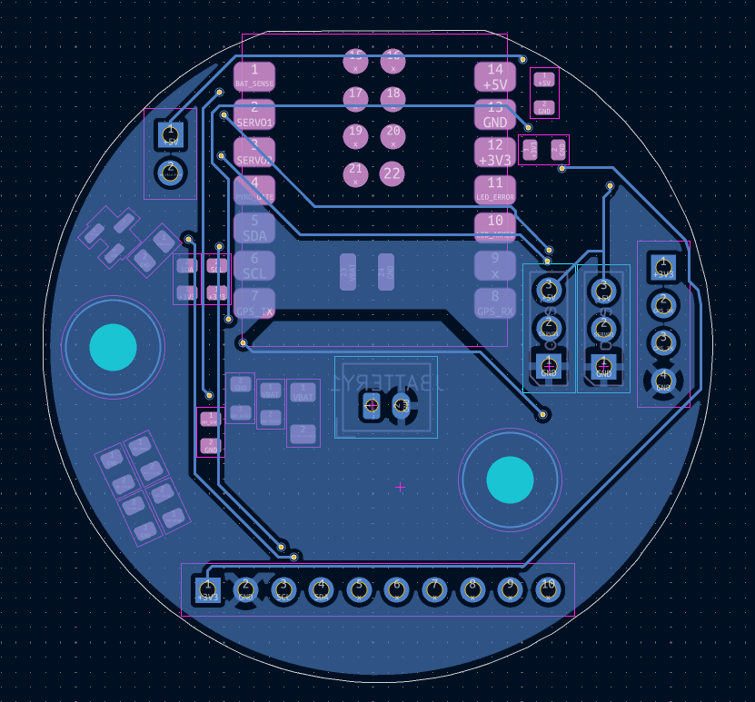
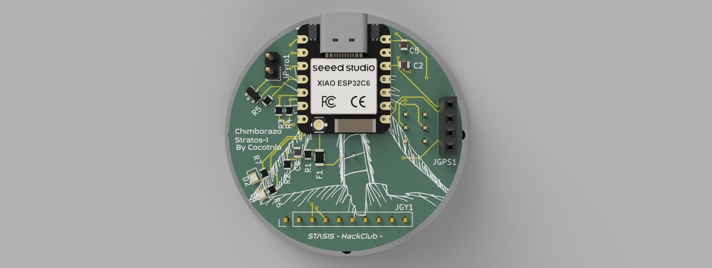

# Chimborazo-Stratos-1 V2
"Designed at the world's closest point to the stars." - me =p A custom Model Rocket Flight Computer (CFC) designed for high-altitude stabilization and recovery. It features an IMU for orientation tracking and a barometer for apogee detection. The goal is to create a reliable, low-cost brain for amateur rocketry in Ecuador.
## The reason behind this project
**"When something is important enough, you do it even if the odds are not in your favor."** *— Elon Musk*
This project is born with the intent of giving my homecountry a posibility or even a first step to develop new technology, maybe *inspire* others just like Astrounauts or cientifics inspired me.
## It's Alive!

  

  

First bring-up worked. The IMU and the barometer both came up on I2C at `0x68` and `0x77`, and the board is now streaming live telemetry over serial at 115200 baud.

Ground pressure read **75207 Pa**. Sea level is 101325 Pa, so the board is literally measuring the real atmosphere of Quito at ~2800m. Altitude noise is around ±0.1m, which is good enough for apogee detection.

The flight state machine goes `ARMED → BOOST → COAST → APOGEE → DESCENT`. Liftoff fires on an acceleration spike above 25 m/s², apogee on a 2m drop from peak altitude. Sensors are read at 50Hz and the dashboard prints every 3 seconds.
## Schematic Overview

  

## PCB

  

<table>
  <tr>
    <td width="50%"></td>
    <td width="50%"></td>
  </tr>
  <tr>
    <td align="center"><b>Front Copper</b></td>
    <td align="center"><b>Back Copper</b></td>
  </tr>
</table>

## CAD MODEL

  

<table>
  <tr>
    <td width="50%"></td>
    <td width="50%"></td>
  </tr>
  <tr>
    <td align="center"><b>Side View</b></td>
    <td align="center"><b>Top View</b></td>
  </tr>
</table>

## Bom 
| Name | Purpose | Qty | Total Cost (USD) | Link |
| :--- | :--- | :---: | :---: | :--- |
| **XIAO ESP32-C6** | Main Flight Computer / MCU | 1 | $11.08 | [AliExpress](https://www.aliexpress.com/item/3256808627180483.html) |
| **GY-87 10DOF** | IMU & Barometer (Orientation/Altitude) | 1 | $1.53 | [AliExpress](https://www.aliexpress.com/item/3256807064707842.html) |
| **ATGM336H GPS** | Global Positioning System Module | 1 | $1.93 | [AliExpress](https://www.aliexpress.com/item/3256810342214632.html) |
| **SG90 Servos (2pcs)** | Canard Actuators (Active Stabilization) | 1 | $1.33 | [AliExpress](https://www.aliexpress.com/item/3256807031850814.html) |
| **JST PH 2.0 Connectors** | LiPo Battery Connection Set | 1 | $1.53 | [AliExpress](https://www.aliexpress.com/item/3256808243626691.html) |
| **40-Pin Headers (M/F)** | Interconnection & Sensor Mounting | 1 | $0.93 | [AliExpress](https://www.aliexpress.com/item/3256811594914967.html) |
| **JLCPCB PCBA** | PCB Manufacturing + SMT Assembly | 1 | $22.46 | [JLCPCB](https://jlcpcb.com) |
## Things I learned the hard way
- The GY-87 has 8 pins starting with `VCC_IN` but my PCB only breaks out 4. Turns out you can feed 3.3V straight into the `3V3` pin and skip the module's onboard regulator entirely. Left `VCC_IN` hanging off the edge and it worked.
- The SG90 servos were browning out my USB port on startup and killing my uploads. In flight they go on the LiPo, never on USB.
- This GY-87 ships with a **BMP180**, not a BMP280. Needs the `Adafruit_BMP085` library.
- The HMC5883L magnetometer hides behind the MPU6050's auxiliary bus. It only shows up at `0x1E` after enabling bypass mode with `INT_PIN_CFG = 0x02`.
## What's next
- [ ] Solder the JST PH 2.0 for the LiPo
- [ ] GPS satellite lock (UART is open, needs open sky)
- [ ] Servo control and canard stabilization
- [ ] Onboard flight data logging
## Final Notes
Thanks for reading! made possible with http://stasis.hackclub.com/
New version! after review
## Dreams
*By cocotrilo*
**made with luv <3**
