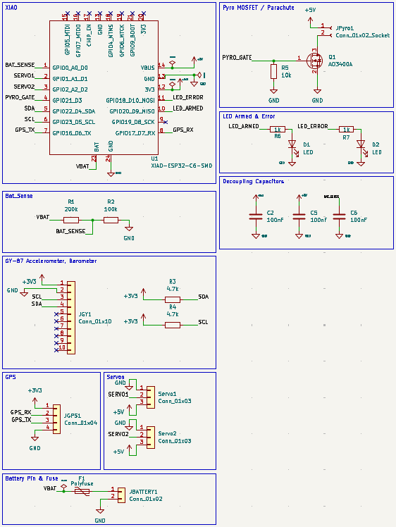
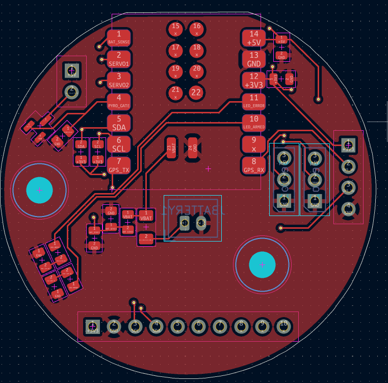
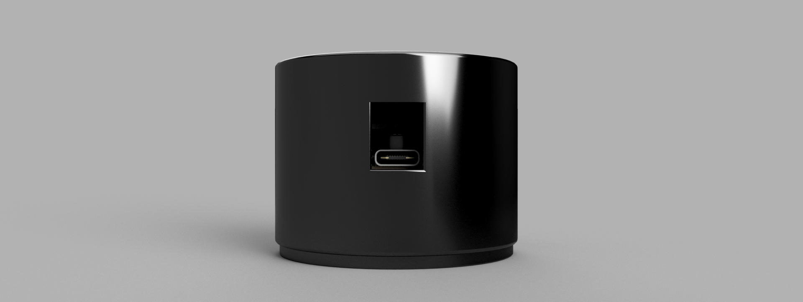

# Chimborazo-Stratos-1 V2
"Designed at the world's closest point to the stars." - me =p A custom Model Rocket Flight Computer (CFC) designed for high-altitude stabilization and recovery. It features an IMU for orientation tracking and a barometer for apogee detection. The goal is to create a reliable, low-cost brain for amateur rocketry in Ecuador.

## The reason behind this project
**"When something is important enough, you do it even if the odds are not in your favor."** *— Elon Musk*
This project is born with the intent of giving my homecountry a posibility or even a first step to develop new technology, maybe *inspire* others just like Astrounauts or cientifics inspired me.

## Schematic Overview

## PCB

## CAD MODEL

## Bom 
| Name | Purpose | Qty | Total Cost (USD) | Link |
| :--- | :--- | :---: | :---: | :--- |
| **XIAO ESP32-C6** | Main Flight Computer / MCU | 1 | $11.08 | [AliExpress](https://www.aliexpress.com/item/3256808627180483.html) |
| **GY-87 10DOF** | IMU & Barometer (Orientation/Altitude) | 1 | $1.53 | [AliExpress](https://www.aliexpress.com/item/3256807064707842.html) |
| **ATGM336H GPS** | Global Positioning System Module | 1 | $1.93 | [AliExpress](https://www.aliexpress.com/item/3256810342214632.html) |
| **SG90 Servos (2pcs)** | Canard Actuators (Active Stabilization) | 1 | $1.33 | [AliExpress](https://www.aliexpress.com/item/3256807031850814.html) |
| **JST PH 2.0 Connectors** | LiPo Battery Connection Set | 1 | $1.53 | [AliExpress](https://www.aliexpress.com/item/3256808243626691.html) |
| **40-Pin Headers (M/F)** | Interconnection & Sensor Mounting | 1 | $0.93 | [AliExpress](https://www.aliexpress.com/item/3256811594914967.html) |
| **JLCPCB PCBA** | PCB Manufacturing + SMT Assembly | 1 | $22.46 | [JLCPCB](https://jlcpcb.com) |

## Final Notes
Thanks for reading! made possible with http://stasis.hackclub.com/
New version! after review
## Dreams
*By cocotrilo*
**made with luv <3**
