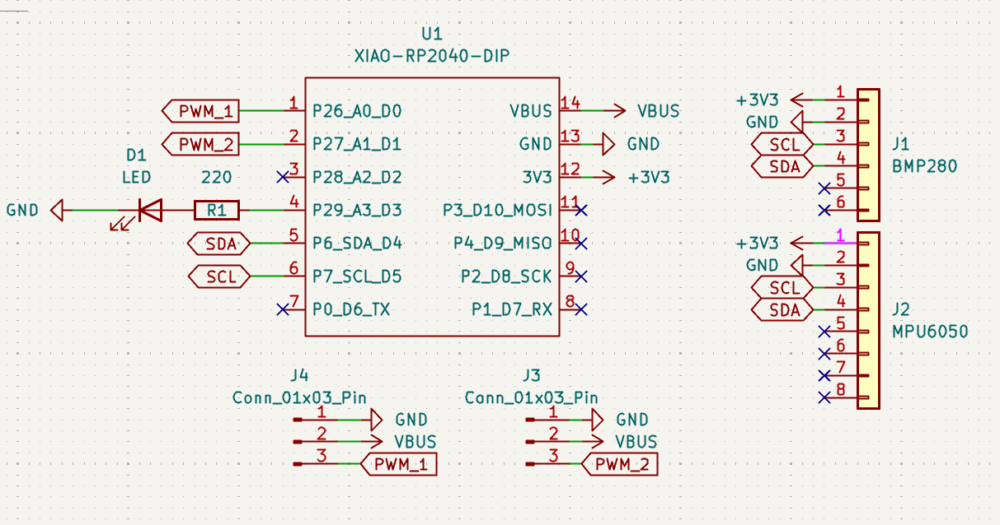
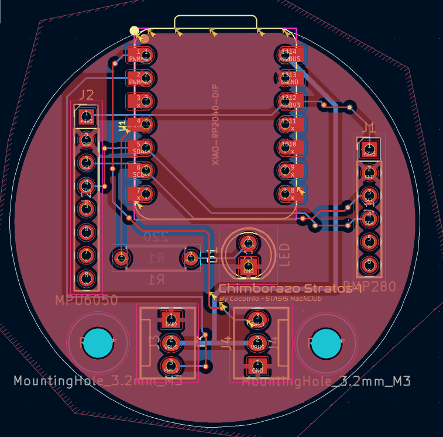
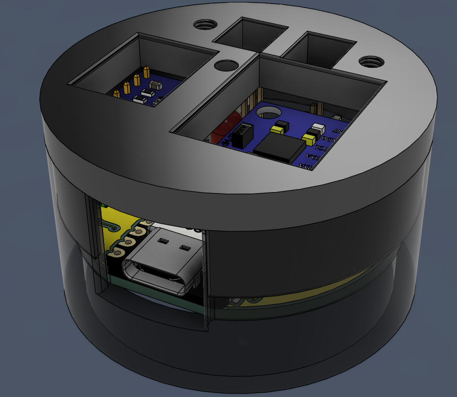

# Chimborazo-Stratos-1
"Designed at the world's closest point to the stars." - me =p A custom Model Rocket Flight Computer (CFC) designed for high-altitude stabilization and recovery. It features an IMU for orientation tracking and a barometer for apogee detection. The goal is to create a reliable, low-cost brain for amateur rocketry in Ecuador.

## Schematic Overview

## PCB

## CAD MODEL

## Bom 
| Item | Component | Quantity | Notes |
|-----:|----------|----------|-------|
| 1 | Seeed Studio XIAO RP2040 | 1 | Main microcontroller |
| 2 | MPU-6050 GY-521 6DOF | 1 | Accelerometer & gyroscope |
| 3 | BMP280-3.3 | 1 | Atmospheric Pressure Sensor |
| 4 | Pin Header & Female Socket | 14 | Hand Soldering |
| 5 | PCB | 1 | Custom designed |
| 6 | Case | 1 | 3D printed |

## Final Notes
Thanks for reading! made possible with http://stasis.hackclub.com/
made with luv <3
